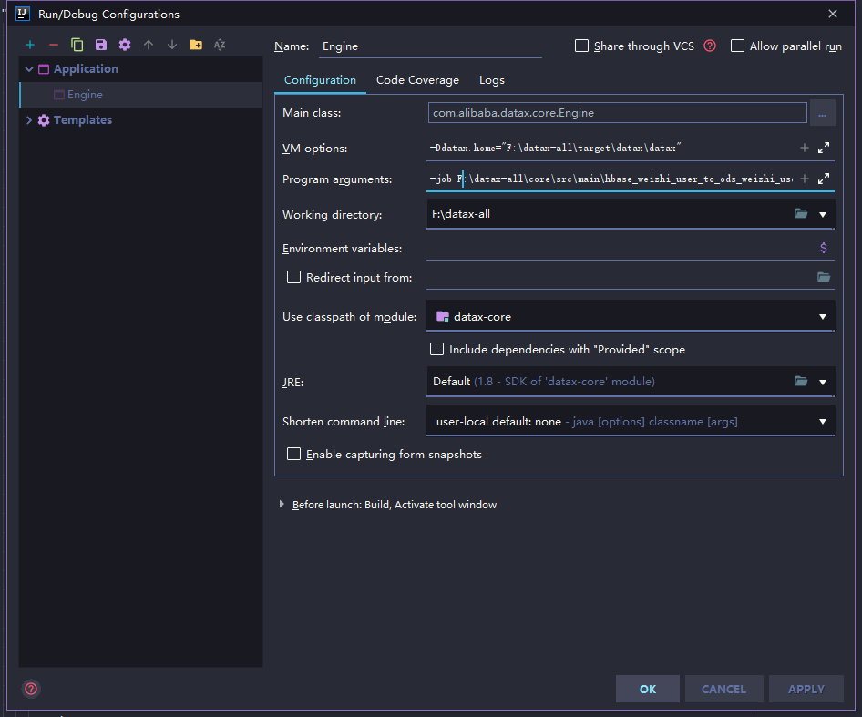
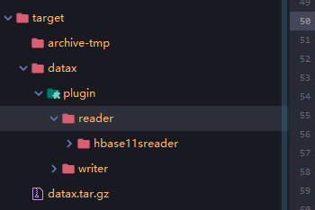

# datax_expansion_tool

> DataX插件拓展和开发项目

## 开发背景

业务需要通过DataX进行小批量数据的拉取操作，现阶段DataX仅支持range中的startRowkey和endRowkey方式进行范围过滤操作，处理上和网络传输开销比较大，业务通过`minTimestamp`和`maxTimestamp`方式进行范围查询，缩小查询范围，减少网络和处理上的开销，这篇文章也可以作为针对的DataX插件开发的参考文档。

## 开发过程

### 源码下载
1. [当前项目源码](http://gitlab.icongtai.com/zebra-bigdata/repo-tools/datax_expansion_tool)
2. 通过Idea使用`VCS->Checkout from Version Control->Git`方式从[DataX官网](https://github.com/alibaba/DataX.git上clone)下代码。

### 源码处理

DataX有个别插件的包如果需要用到的话，需要处理一下，否则在最后所有插件打包时会报错。

1. `odpsreader`和`odpswriter`的pom文件中，`odps-sdk-core`版本修改为`0.20.7-public`

   ```xml
   <dependency>
       <groupId>com.aliyun.odps</groupId>
       <artifactId>odps-sdk-core</artifactId>
       <version>0.20.7-public</version>
   </dependency>
   ```

2. `otsstreamreader`模块pom文件中，`tablestore-streamclient`版本修改为`1.0.0`

   ```xml
   <dependency>
       <groupId>com.aliyun.openservices</groupId>
       <artifactId>tablestore-streamclient</artifactId>
       <version>1.0.0</version>
   </dependency>
   ```

3. `hdfsreader`和`hdfswriter`模块中会报出`eigenbase-properties`会提示找不到包，根据maven中心库查询可知 **Note**: this artifact it located at **Spring Plugins** repository (https://repo.spring.io/plugins-release/)，maven配置文件中添加Spring插件库，`maven->conf->setting.xml`添加如下

   ```xml
   <repository>
       <id>spring-plugin</id>
       <name>Spring plugin</name>
       <url>https://repo.spring.io/plugins-release/</url>
       <releases>
           <enabled>true</enabled>
       </releases>
       <snapshots>
           <enabled>false</enabled>
       </snapshots>
   </repository>
   ```

   通过以上处理DataX源码，在DataX主目录可以通过`mvn -U clean package assembly:assembly -Dmaven.test.skip=true`进行打包。DataX是通过assembly进行打包和处理文件，详细操作方式参考[assembly插件文档](https://github.com/apache/maven-assembly-plugin/)

### 代码开发

本篇主要是针对HBase的reader添加timestamp方式进行数据过滤，其他方式的插件修改和开发操作参看[官方文档](https://github.com/alibaba/DataX/blob/master/dataxPluginDev.md)，新建的一个比较简单项目，需要操作以下步骤。

#### 代码引入和结构解析

1. 新项目需要用到DataX源码中的核心代码`common`、`core`，`transformer`，是主要的启动方式代码，`common`为工具类和常量类，`core`为核心启动入口和本地测试的主要入口，主要会用到`com.alibaba.datax.core.Engine`
2. 项目的主要配置文件`package.xml`和`pom.xml`，`package.xml`配置需要开发的插件，该项目为`hbase11sreader`、`hdfswriter`、`txtfilewriter`，`plugin-unstructured-storage-util`，`hbase11sreader`是当前修改的插件，基于`hbase11xreader`插件进行开发，`hdfswriter`是业务需要的导入hdfs插件，`txtfilewriter`可以用来本地进行测试，依赖于`plugin-unstructured-storage-util`需要引入。

#### 代码步骤

1. 配置插件入口`resources/plugin.json`

   ```
   {
       "name": "hbase11sreader",
       "class": "com.alibaba.datax.plugin.reader.hbase11sreader.Hbase11sReader",
       "description": "useScene: prod. mechanism: Scan to read data.",
       "developer": "alibaba"
   }
   ```

2. 配置打包路径`assembly/package.xml`

   ```
   <outputDirectory>plugin/reader/hbase11sreader</outputDirectory>
   ```

3. 为了简化开发，具体的HBase查找属性依旧为DataX json配置文件range元素下，完整json模板文件如下

   ```json
   {
       "name": "hbase11sreader",
       "parameter": {
           "hbaseConfig": {},
           "table": "",
           "encoding": "",
           "mode": "",
           "column": [],
           "range": {
               "startRowkey": "",
               "endRowkey": "",
               "minTimestamp":"",
               "maxTimestamp":"",
               "isBinaryRowkey": true
           }
       }
   }
   ```

4. DataX读取json文件的工具类为传入path，例如获取startRowkey，要传入路径为`range.startRowkey`，程序中为了简化多次获取操作和常量的使用，在`com.alibaba.datax.plugin.reader.hbase11sreader.Hbase11sHelper#validateParameter`里进行读取的处理

   ```java
       String minTimestamp = originalConfig.getString(Constant.RANGE + "." + Key.MIN_TIMESTAMP);
       String maxTimestamp = originalConfig.getString(Constant.RANGE + "." + Key.MAX_TIMESTAMP);
   ```

5. `com.alibaba.datax.plugin.reader.hbase11sreader.Hbase11sHelper#convertInnerMaxTimestamp`和`com.alibaba.datax.plugin.reader.hbase11sreader.Hbase11sHelper#convertInnerMinTimestamp`获取配置的最大最小时间

6. 通过`com.alibaba.datax.plugin.reader.hbase11sreader.HbaseAbstractTask#prepare`方法将获取到的配置信息使用HBase Client API中`Scan`的`public Scan setTimeRange(long minStamp,long maxStamp)throws IOException`方法添加到查询对象中

### 代码测试

基于该项目，测试代码中需要获取到`datax.home`环境变量作为编译打包后的主要目录，本例中都是使用的是编译后解压后的datax文件夹作为`datax.home`，在idea中通过`Edit Configrations`配置`VM Options`运行参数`-Ddatax.home="F:\datax-all\target\datax\datax"`，将`core`模块中，默认配置文件添加到`datax.home`中。通过`Edit Configrations`配置`Program arguments`项目参数指定DataX json文件和jobid，`-job F:\datax-all\core\src\main\hbase_weizhi_user_to_ods_weizhi_user.json -jobid 123456`，运行`com.alibaba.datax.core.Engine#main`进行文件读取和测试。

#### 测试

对测试数据进行测试，对HBase数据进行读取，写入到文本文件中。

| 测试用例                                                     | 预期结果                  |
| ------------------------------------------------------------ | ------------------------- |
| 不传入startRowkey,endRowkey,startTimestamp,endTimestamp      | 所有数据                  |
| 传入startRowkey,endRowkey,不传入startTimestamp,endTimestamp  | 按照rowkey进行范围查询    |
| 传入startRowkey，endRowkey，startTimestamp，不传入endTimestamp | 抛出参数异常错误          |
| 传入startRowkey，endRowkey，endTimestamp，不传入startTimestamp | 抛出参数异常错误          |
| 传入startTimestamp,endTimestamp，不传入startRowkey,endRowkey | 按照timestamp筛选数据     |
| 传入startRowkey,endRowkey,startTimestamp,endTimestamp        | 按照rowkey和timestamp过滤 |

测试json文件

```json
{
  "job": {
    "setting": {
      "speed": {
        "channel": 1
      },
      "errorLimit": {
        "record": 0,
        "percentage": 0.002
      }
    },
    "content": [
      {
        "reader": {
          "name": "hbase11sreader",
          "parameter": {
            "hbaseConfig": { "hbase.zookeeper.quorum":"47.97.74.164:2181"},
            "table":"WEIZHI_USER",
            "encoding": "utf-8",
            "mode": "normal",
            "column": [
              {
                "name": "rowkey",
                "type": "string"
              },
              {
                "name": "cf:workPlace",
                "type": "string"
              }
            ],
            "range": {
              "startRowkey": "",
              "endRowkey": "",
              "minTimestamp":"1506691226669",
              "maxTimestamp":"1506691230789"
            }
          }
        },
        "writer": {
          "name": "txtfilewriter",
          "parameter": {
            "path": "/data/",
            "fileName": "qiran",
            "writeMode": "truncate"
          }
        }
      }
    ]
  }
}

```

运行类主要配置



运行结果会在json中配置好的路径中生成txt文件，本例中是当前盘符根路径/data文件夹下，生成配置文件名+随机数字的文本。

### 代码打包

在项目主目录使用`mvn -U clean package assembly:assembly -Dmaven.test.skip=true`进行打包，打包结果在target目录下datax.tar.gz，只包含了编写的插件部分，目录结构如下



### 代码发布

为了和使用中的DataX进行整合，将编写好的插件，复制到环境中DataX的目录下，当前是新增的reader插件，对应放在plugin->reader目录下。如果是修改，可以直接替换掉。以下是该项目打包好的插件压缩文件，[插件文件](http://gitlab.icongtai.com/zebra-bigdata/repo-tools/datax_expansion_tool/blob/master/hbase11sreader.zip.gz)