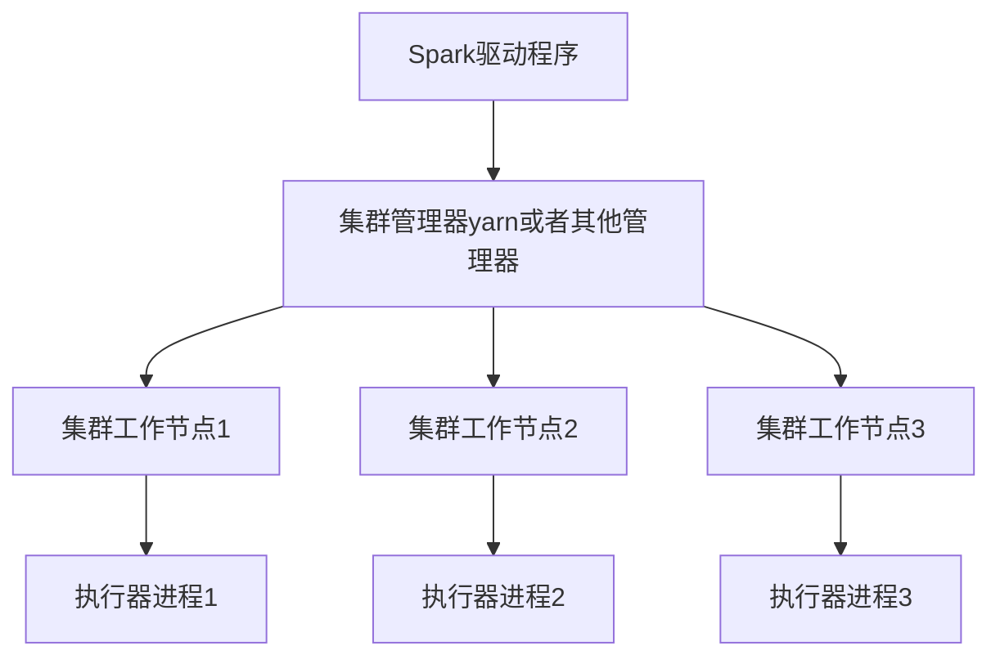
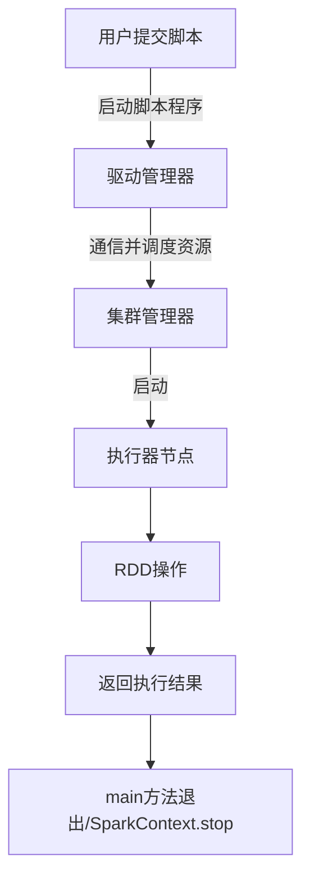

[TOC]


# 键值对操作

#### pair rdd

常用二元操作

| 函数名        | 使用                       |
| ------------- | -------------------------- |
| reduceByKey   | 合并相同键值对             |
| groupByKey    | 对具有相同键值对的进行分组 |
| conbineByKey  | 合并不同类型               |
| mapValues     | 不改变键，单纯改变值       |
| flatMapValues |                            |


mapValues

```scala
val list = List("hadoop","spark","hive","spark")
val rdd = sc.parallelize(list)
val pairRdd = rdd.map(x => (x,1))
pairRdd.mapValues(_+1).collect.foreach(println)//对每个value进行+1
```

|               |                                       |
| ------------- | ------------------------------------- |
| subtractByKey | 删除相同元素                          |
| join          |                                       |
| cogroup       | 将两个 RDD 中有相同键的数据分组到一起 |

#### 数据混洗操作

repartition()：通过网络方式进行数据的混洗，新建新的分区操作集合，代价比较大

coalesce()：优化过的repartition()的操作

### 数据分组

groupByKey

### 数据连接

jion,leftOuterJoin,rightOuterJoin


## Pair RDD 行动操作

| 函数         | 描述                 | 示例           |
| ------------ | -------------------- | -------------- |
| countByKey   | 根据key进行统计个数  | rdd.countByKey |
| collectAsMap | 将结果以map形式映射  |                |
| lookup(key)  | 返回给定键的所有数值 |                |


## 数据分区

partitionBy是一次转换操作，会创建一个新的RDD,不会改变原来的rdd,partitionBy的分区个数应该是和可用核心数保持一致，会根据核心数决定并行任务数目。

### 获取分区方式

pair.partitioner获取分区，如果分区后的数据需要多次使用，一般都会用persist()或者cache()方式持久化,防止一次一次进行分区操作

| 特性 | cache | persist |
| ---- | ----- | ------- |
|      |       |         |


#### 缓存级别

```scala
object StorageLevel {
  val NONE = new StorageLevel(false, false, false, false)
  val DISK_ONLY = new StorageLevel(true, false, false, false)
  val DISK_ONLY_2 = new StorageLevel(true, false, false, false, 2)
  val MEMORY_ONLY = new StorageLevel(false, true, false, true)
  val MEMORY_ONLY_2 = new StorageLevel(false, true, false, true, 2)
  val MEMORY_ONLY_SER = new StorageLevel(false, true, false, false)
  val MEMORY_ONLY_SER_2 = new StorageLevel(false, true, false, false, 2)
  val MEMORY_AND_DISK = new StorageLevel(true, true, false, true)
  val MEMORY_AND_DISK_2 = new StorageLevel(true, true, false, true, 2)
  val MEMORY_AND_DISK_SER = new StorageLevel(true, true, false, false)
  val MEMORY_AND_DISK_SER_2 = new StorageLevel(true, true, false, false, 2)
  val OFF_HEAP = new StorageLevel(true, true, true, false, 1)
}
```

# 数据的读取与保存

## 动机

java 可通过InputFormat或者OutputFormat 访问数据，不同的文件系统会有不同的配置和压缩方式

## 文件格式

| 文件格式        | 结构化   | 备注             |
| --------------- | -------- | ---------------- |
| 文本文件        | 否       |                  |
| json            | 半结构化 |                  |
| csv             | 结构化   |                  |
| sequenceFiles   | 结构化   |                  |
| Protocal buffer | 结构化   |                  |
| 对象文件        | 结构化   | 依赖于Java序列化 |

### 文本文件

#### 读取

可以一行为一个RDD元素，或者多个文本作为Pair RDD

```scala
var input = sc.textFile(path)
```

针对许多数据可以使用wholeTextFile()生成多文件的Pair RDD，文件路径支持模糊匹配的方式。

```scala
var input = sc.wholeTextFile(path)
```

#### 保存

如果是PairRDD，会保存多个文本文件。

```scala
result.saveAsTextFile(path)
```

### JSON

#### 读取

```scala
case class Person(name: String, lovesPandas: Boolean)
val result = input.flatMap(record => {
try {
	Some(mapper.readValue(record, classOf[Person]))
} catch {
	case e: Exception => None
}})
```

#### 保存

```scala
result.map(mapper.writeValueAsString(_)).saveAsTextFile(path)
```

### CSV

#### 读取

 `Hadoop InputFormat`不支持包含换行符的记录

```scala
val input = sc.textFile(inputFile)
val result = input.map{ line =>
    val reader = new CSVReader(new StringReader(line));
    reader.readNext();
}
```

*文件解析如果文件过大则会导致解析时候成为性能瓶颈*

#### 保存

```scala
pandaLovers.map(person => List(person.name, person.idCard).toArray)
.mapPartitions{
    people =>
        val stringWriter = new StringWriter();
        val csvWriter = new CSVWriter(stringWriter);
        csvWriter.writeAll(people.toList)
        Iterator(stringWriter.toString)
}.saveAsTextFile(outFile)
```

### SequenceFile

#### 读取

`sequence`文件是通过参数`Writable`确定具体的类型

```scala
var data = sc.sequenceFile(path,keyClass,valueClass,minPartitions)
/*val data = sc.sequenceFile(inFile, classOf[Text], classOf[IntWritable]).map{case (x, y) => (x.toString, y.get())}*/
```

#### 保存

### 对象文件

对象文件的局限性，是如果对象字段修改需要，保存的对象文件不再可读

#### 读取

```scala
var data = sc.hadoopFile()
```

### 文件压缩

| 格式   | 是否可分割 | 平均压缩效率 | 压缩效率(由高到低) |
| ------ | ---------- | ------------ | ------------------ |
| gzip   | 否         |              |                    |
| lzo    | 是         |              |                    |
| zlib   | 否         |              |                    |
| Snappy | 否         | 非常快       |                    |

## Spark SQL的机构化数据

### Hive

```scala
import org.apache.spark.sql.hive.HiveContext
val hiveCtx = new org.apache.spark.sql.hive.HiveContext(sc)
val rows = hiveCtx.sql("SELECT name, age FROM users")
val firstRow = rows.first()
println(firstRow.getString(0))
```

### JSON

```scala
var json = "{\"user\": {\"name\": \"Holden\", \"location\": \"San Francisco\"}, \"text\": \"Nice day out today\"}\n{\"user\": {\"name\": \"Matei\", \"location\": \"Berkeley\"}, \"text\": \"Even nicer here :)\"}"xxxxxxxxxx var var json = "{\"user\": {\"name\": \"Holden\", \"location\": \"San Francisco\"}, \"text\": \"Nice day out today\"}\n{\"user\": {\"name\": \"Matei\", \"location\": \"Berkeley\"}, \"text\": \"Even nicer here :)\"}"

hiveCtx.jsonFile(json)
```

# Spark 编程进阶

## 简介

*共享变量：累加器和广播变量*

## 累加器

```scala
var callSigns = sc.longAccumulator

val callSigns = file.flatMap(line => {
    if (line == "") {
        blankLines += 1
    }
    line.split(" ")
})
```

**使用步骤**

+ 初始化累加器
+ 闭包中进行add累加器
+ 通过累加器的value属性获取累加器的值

### 累加器与容错性

> 如果想要失败还是重复计算都是可靠的累加器，放在foreach中，防止RDD的抢占或者失败状况

### 自定义累加器

```scala
var accumulator = AccumulatorParam[Int]
```

## 广播变量

**实现过程**

+ sparkContext.broadCast生成一个对象
+ 通过value访问对象的值
+ 变量只会发送到各个节点一次，作为只读处理

**广播的优化**

+ 性能瓶颈：想要广播的数据进行序列化操作，减少网络传输的时间
+ 可以使用spark.serializer指定序列化方式
+ Kryo更加的高效

## 基于分区的操作

| 操作函数               | 描述                           | 返回值     |
| ---------------------- | ------------------------------ | ---------- |
| mapPartitions          | 处理该分区数据的迭代器         | 元素迭代器 |
| mapPartitionsWithIndex | 处理该分区数据的迭代器以及序号 | 元素迭代器 |
| foreachPartitions      | 元素迭代器                     | 无         |

## 与外部程序间的管道

RDD的pipe()方法可以提供与其他程序语言交互

## 数值RDD 操作

1. 常用函数

| 方法           | 含义               |
| -------------- | ------------------ |
| count          |                    |
| mean           | 平均值             |
| sum            | 总和               |
| max            | 最大值             |
| min            | 最小值             |
| variance       | 元素的方差         |
| sampleVariance | 采样中计算出的方差 |
| stdev          | 标准差             |
| sampleStdev    | 采样中的标准差     |

2. 部分具体函数使用

   1. sample(withReplacement: Boolean, fraction: Double, seed: Int)

      随机挑选产生新的RDD，withReplacement表示是否允许重复挑选，fraction表示挑选比例，seed表示随机初始化种子

   2. sampleByKey(withReplacement: Boolean, fractions: Map[K, Double], seed: Long

      先将每一个key相同的聚合在一起，然后在相同的key之间按照指定的权重筛选，用户需要自定义一个Map来确定每个key筛选的比例

   3. ###### stats()

      产生统计学方法，同时计算RDD中的平均值，方差，标准差，最大值和最小值

# 集群上运行Spark

## Spark运行时的架构



### 驱动器节点

驱动器的职责：

1. 把用户程序转为任务task，形成逻辑上的有向无环图(DAG)，Spark会执行一系列的优化
   + 连续映射转化为流水线操作
   + 多个操作合并为一个
   + 转化为步骤(stage)
2. 为执行节点调度任务
   + 会跟踪执行其中的临时数据，为接下来的调度做准备

### 执行器节点

执行器的职责：

1. 进行Spark的业务的运算，并将数据返回驱动器
2. 通过本身的块管理器，对计算中的RDD进行缓存

### 集群管理器

> 主节点和工作节点是针对去中心化和分布式所强调的方面。


提交过程



## Spark submit

1. master 标记接收值

| 参数     | 描述           |
| -------- | -------------- |
| local    | 本地单核       |
| local[N] | 本地N核        |
| local[*] | 本地尽可能多核 |

2. Spark 高可用


	[官方文档中主从节点的切换][1]

   [1]: https://spark.apache.org/docs/latest/spark-standalone.html#standby-masters-with-zookeeper

   

