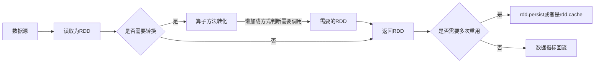

# 数据开发知识点和经验总结

## 数据开发主要注意的问题

### 设计方面
+ 表设计回流数据和非回流数据字段进行拆分
+ 数据如果落库HBase的key-value设计
+ 数据产出：月数据/天数据，回流方式：月回流/天回流，回流数量：全量（覆盖）/增量，分区属性：月/天
+ 数据调度：按照t+1(回流上一天)对落库的数据是否有影响
+ 数仓表设计同步问题
### 代码方面
+ 动态分区条件，回流端是否分库分表以及具体场景
+ sql中关联处理方式,关联时先对查询里做好限制，减少关联数据量
+ 对于空串，null，空值的处理

## 基本概念

### RDD(弹性分布式数据集)

1. RDD分片(分布式)：容错性可用性，分区后某个区间的数据丢失会根据源数据进行重新计算，***RDD Graph可以转化为有向无图的原因，要求数据可以追溯源头***
2. RDD创建：可以通过Hadoop或者是Hive等数据源，或者是程序集合
3. RDD写入磁盘(弹性)：内存不足会写入磁盘，默认是在内存中

### 数据的关联操作
>对数据根据部分条件进行匹配查询结果，join语法格式：关联主表 left/right join 关联副表 on  关联条件,union/union all 语法格式：表1 union all 表2

*举栗子*

表a

| user_id   | name |
| --------- | ---- |
| userId_01 | 张三 |
| userId_02 | 李四 |
| userId_03 | 王五 |

表b

| user_id   | food |
| --------- | ---- |
| userId_02 | 面   |
| userId_03 | 饭   |
| userId_04 | 饼   |

#### left join

##### a left join b on a.user_id=b.user_id

| a.user_id | a.name | b.user_id | b.food |
| --------- | ------ | --------- | ------ |
| userId_01 | 张三   | null      | null   |
| userId_02 | 李四   | userId_02 | 面     |
| userId_03 | 王五   | userId_03 | 饭     |

#### inner join

##### a inner join b on a.user_id=b.user_id

| a.user_id | a.name | b.user_id | b.food |
| --------- | ------ | --------- | ------ |
| userId_02 | 李四   | userId_02 | 面     |
| userId_03 | 王五   | userId_03 | 饭     |

#### union/union all

>数据拼接，要求字段名一致，字段个数一致，一般是多个select 语句拼接

*举个有点怪的栗子*

##### select user_id,name from a union all select user_id as user_id,food as name from b

| user_id   | name |
| --------- | ---- |
| userId_01 | 张三 |
| userId_02 | 李四 |
| userId_03 | 王五 |
| userId_02 | 面   |
| userId_03 | 饭   |
| userId_04 | 饼   |

### 依赖关系

> DAG：有向无环图

1. 窄依赖：父RDD分区对应一个子RDD，过滤操作：filter(),遍历操作：map()
2. 宽依赖：父RDD分区对应多个子RDD，reduceByKey()，去重操作：distinct()

### 数据混洗（shuffle）

需要对所有的分区进行整合操作


### Job,Stage,Task

1. Job:RDD的一次action就是一个Job
2. Stage:每一次stuffle就是一个Stage，组成job依次执行
3. Task:RDD存在多少个分区就会有多少个task

```scala
//toDebugString查看RDD的族谱
val count = input.map(line => line.split(" ")).filter(word => word.length > 0).map(word => (word(0), 1)).reduceByKey({
    (a, b) => a + b
})
println(count.toDebugString)
/*
(50) ShuffledRDD[7] at reduceByKey at TestRdd.scala:32 []
 +-(1) MapPartitionsRDD[6] at map at TestRdd.scala:31 []
    |  MapPartitionsRDD[5] at filter at TestRdd.scala:31 []
    |  MapPartitionsRDD[4] at map at TestRdd.scala:31 []
    |  MapPartitionsRDD[3] at rdd at TestRdd.scala:31 []
    |  MapPartitionsRDD[2] at rdd at TestRdd.scala:31 []
    |  MapPartitionsRDD[1] at rdd at TestRdd.scala:31 []
    |  FileScanRDD[0] at rdd at TestRdd.scala:31 []
*/
```

### 分区

数据分区：以文件夹作为区分，便于查询定位数据

RDD分区：分区是RDD内部并行计算的一个计算单元，RDD的数据集在逻辑上被划分为多个分片，每一个分片称为分区，分区的格式决定了并行计算的粒度，而每个分区的数值计算都是在一个任务中进行的，因此任务的个数，也是由RDD(准确来说是作业最后一个RDD)的分区数决定。

#### Tuple元组

Tuple元组，Tuple1-Tuple22，由n个元素组成的元组

## 开发流程

